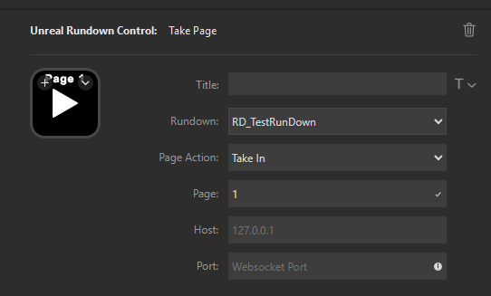

# UnrealRundownControl
Unreal Rundown Control is a Stream Deck plugin that allows you to control Unreal Engine Motion Design Rundowns through a Stream Deck.

## Required Setup
### Web Socket Messaging

In an Unreal Engine project using Motion Design make sure you also have enabled the "Web Socket Messaging" plugin. In your project settings go down to the WebSocket Messaging settings and make sure Enable Transport is checked and set a Port for the web socket server to run on.

### Rundown Messaging Server
Ensure that you are running the Rundow Messaging server. You can run "MotionDesignRundownServer.Start" in the Command Console. You can also run "MotionDesignRundownServer.Status" to make sure the server is running.

## Plugin Settings

There are 5 settings for the Take plugin action which is the action that allows you to take in or out a rundown page.

**Rundown** - The object path to your rundown asset you are wanting to control. You can get this by going to your asset in your Content Browser and right cliking then selecting copy object path

**Action** - This is where you set whether you want to Take In or Take Out the desired page. Switching this setting will also switch the Icon however manually setting a different Icon will override that. *It is planned to allow Preview in and out as well.*

**Page** - The page that you want to control in your rundown. Enter the number of the page without the leading 0's so page 0001 is just entered as 1. The page number is used in the title of the button to see what page the button is changing.

**Host** - The IP for the host server running Unreal. You can just enter 1270.0.1 for your local machine. *Planning on making that a default value so it does not need to be entered every time.*

**Port** - This is the port that you set your Web Socket Messaging to use in your project settings.

## Contact

If you are have any feature requests or find bugs you can contact me via email or discord.

Email: afadedknight@gmail.com
Discord: afadedknight